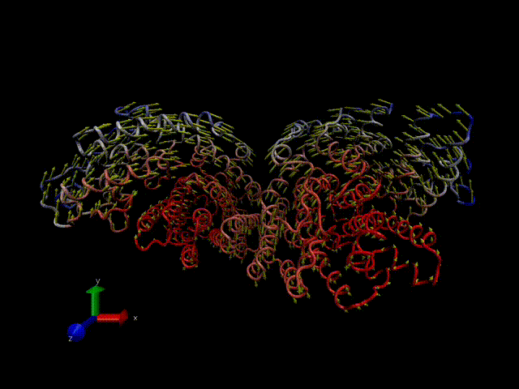
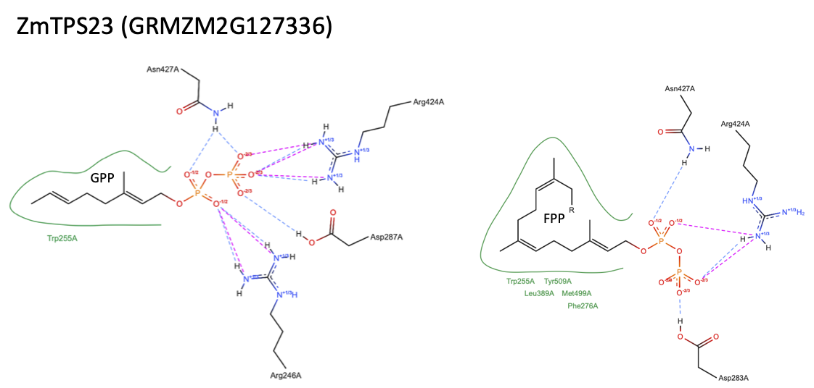
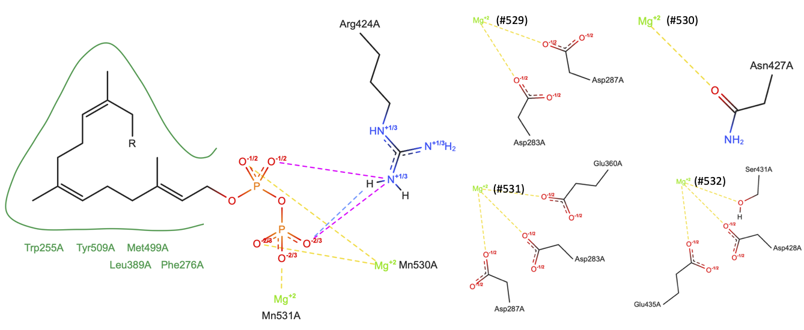
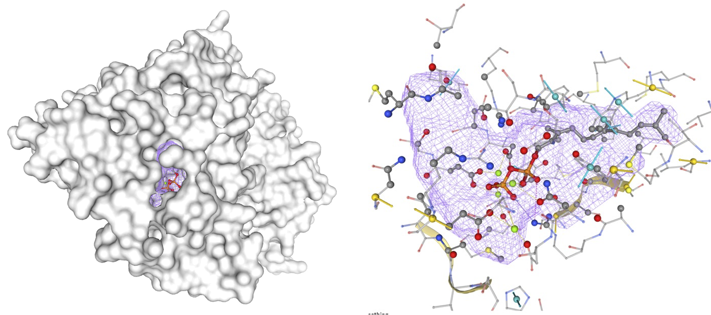
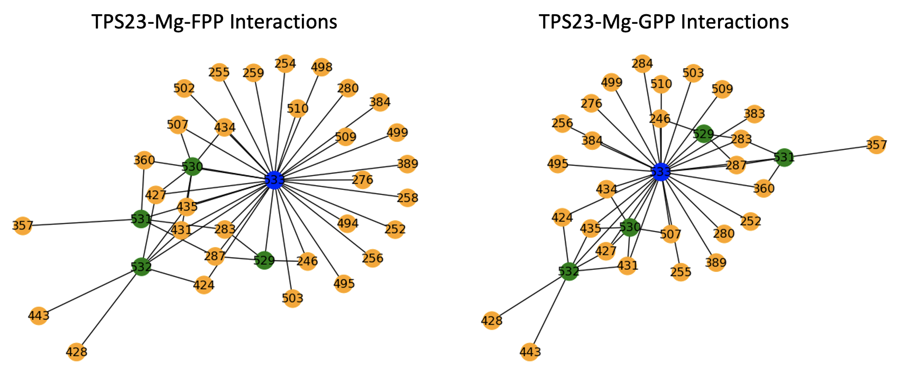

# PlantDiffusion

# Introduction

Applying the latest methods in protein structure prediction, protein design and ligand docking.

# Case study #1

## Maize Terpene Synthases (TPS) 

# Normal Mode Analysis using ProDy visualized with VMD

# Molecular docking results of TPS substrates

